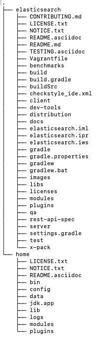

# 编译源码
## 准备环境
* jdk15
* idea 2022
* gradle 7.0.1
## 开始编译
* 直接查看CONTRIBUTING.md(Importing the project into IntelliJ IDEA)
* 打开idea 导入项目等待编译完成
* 编译启动所需的产品包，查看README.asciidoc ，执行命令
    ```text
    ./gradlew localDistro
    ```
  生成的文件包在elasticsearcg/build/distribution/local/elasticsearch-7.13.5-SNAPSHOT
  复制 elasticsearch-7.13.5-SNAPSHOT到elasticsearch同级目录下，修改名称为home
* 新建 home/config/java.policy 内容如下
 ```text
    grant {
    permission javax.management.MBeanTruxtPermission "register";
    permission javax.management.MBeanServerPermission "createMBeanServer";
    permission java.lang.RuntimePermission "createClassLoader";
    permission java.lang.RuntimePermission "getClassLoader";
    permission java.lang.RuntimePermission "setContextClassLoader";
    };
  ```
## 启动问题解决
* ERROR: the system property [es.path.conf] must be set
    ```text
    -Des.path.conf=/cxt/codework/github/elasticsearch/7.13/home/config
    ```
* Exception in thread "main" java.lang.IllegalStateException: path.home is not configured
    ```text
    -Des.path.home=/cxt/codework/github/elasticsearch/7.13/home
    ```
* main ERROR Could not register mbeans java.security.AccessControlException: access denied ("javax.management.MBeanTrustPermission" "register")
    ```text
     -Djava.security.policy=/cxt/codework/github/elasticsearch/7.13/home/config/java.policy
     -Dlog4j2.disable.jmx=true
    ```
* Unknown codebases [codebase.elasticsearch-plugin-classloader, codebase.elasticsearch, codebase.elasticsearch-secure-sm] in policy file [***]

    找到 org/elasticsearch/bootstrap/security.policy 文件，依次把[codebase.elasticsearch-plugin-classloader, codebase.elasticsearch, codebase.elasticsearch-secure-sm] 注释掉

## 总结

* 文件夹结构


* 启动时所需配置的参数
```text
-Des.path.conf=/cxt/codework/github/elasticsearch/7.13/home/config
-Des.path.home=/cxt/codework/github/elasticsearch/7.13/home
-Djava.security.policy=/cxt/codework/github/elasticsearch/7.13/home/config/java.policy
-Dlog4j2.disable.jmx=true
```
